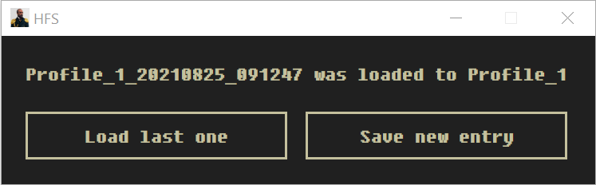

# HighFleet Saver



[HighFleet](https://store.steampowered.com/app/1434950/HighFleet) is a unique action-strategy game mixing arcade combat, exploration, management and diplomacy.
However, the save system is inconvenient. The game allows you to do it only at certain rare points. Use this utility to save your progress.

First you should configure utility using `config.toml` file:

```toml
Path = "D:\\SteamLibrary\\steamapps\\common\\HighFleet"
ProfileNumber = 1
```

`Path` is the path to where the game is installed. `ProfileNumber` is the number of profile you use. There are three profiles by default.
Note that `Path` value should be escaped with backslashes!

Remember to always return to main menu before saving or loading.
Save button allows you to save your profile any time. Profile with timestamp will be created in `Store` dir inside HighFleet game dir.
Hit the load button to load last save.

## Install

No istallation needed. Just edit `config.toml` and run `hfs.exe` file.

## Build

```
wails build
```

## Run in development mode

This program was built using [Wails](https://wails.app) which enables you write desktop apps using Go and web technologies.

```
wails serve

cd frontend
npm run serve
```
